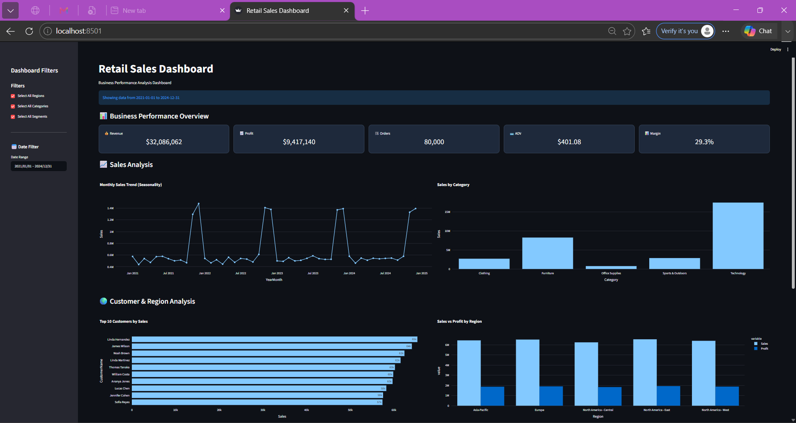

# Retail Sales Analytics Dashboard

## Project Overview

This project analyzes retail sales data from 2021–2024 and provides an interactive dashboard for business decision-making.

## Features

- KPI Cards
  - Revenue
  - Profit
  - Orders
  - Average Order Value (AOV)
  - Profit Margin

- Interactive Filters
  - Region
  - Category
  - Segment
  - Date Range

- Visualizations
  - Monthly Sales Trend
  - Sales by Category
  - Top Customers Analysis
  - Sales vs Profit by Region

## Tools Used

- Python
- Pandas
- Plotly
- Streamlit

## Project Structure

```text
Retail-Sales-Analytics-Dashboard/
│
├── sales_dashboard.py              # Streamlit dashboard application
├── cleaned_retail_sales.csv        # Dataset used for analysis
├── requirements.txt               # Project dependencies
├── readme.md                      # Project documentation
│
├── screenshots/
│   ├── dashboard_overview.png     # Dashboard overview screenshot
│   ├── region_filter.png          # Region filter example
│   └── category_filter.png        # Category filter example
│
├── Retail Sales Analytics report.pdf
└── retail_sales_analytics_ppt.pdf
```


## Dashboard Preview



## Run Locally

```bash
pip install -r requirements.txt
python -m streamlit run sales_dashboard.py

## about above command
That is perfectly professional and many developers actually prefer it because it guarantees Streamlit runs using the same Python environment where the packages were installed.

So there is **no problem at all** with using:

```bash
python -m streamlit run sales_dashboard.py
```

## Project Outcomes

Cleaned and analyzed retail sales data
Built interactive dashboard
Generated business insights
Developed actionable recommendations


---

## Author

**Fathima Nahla Noushad EV**

---


